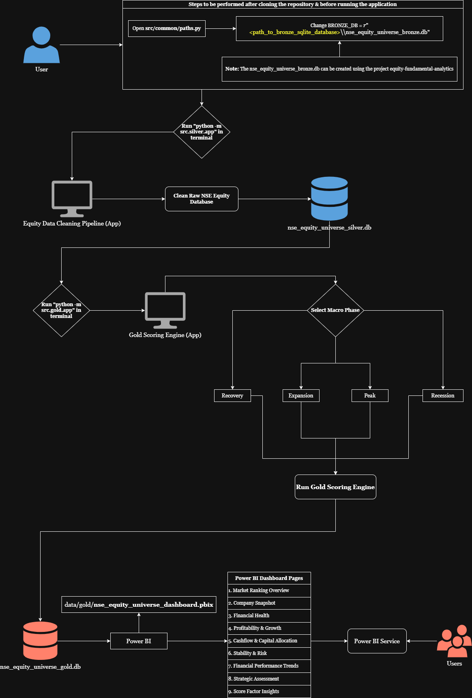

<!-- ======================= -->
<!--        HEADER           -->
<!-- ======================= -->

<h1 align="center">📚 EQUITY INTELLIGENCE SYSTEM </h1>

<p align="center">
  <b>Equity Fundamental Analytics</b><br>
  <sub>The analytical backbone for systematic equity research and data-driven financial modeling</sub><br>
  <sub>Built with SQL  • Python  • Power BI
</p>

<p align="center">
  <!-- Tech Stack -->
  
  
  
  <img src="https://img.shields.io/badge/Visualization-Power BI-FFB903?logo=data:image/svg+xml;base64,PD94bWwgdmVyc2lvbj0iMS4wIiBlbmNvZGluZz0iVVRGLTgiIHN0YW5kYWxvbmU9Im5vIj8+CjxzdmcKICAgeG1sbnM6ZGM9Imh0dHA6Ly9wdXJsLm9yZy9kYy9lbGVtZW50cy8xLjEvIgogICB4bWxuczpjYz0iaHR0cDovL2NyZWF0aXZlY29tbW9ucy5vcmcvbnMjIgogICB4bWxuczpyZGY9Imh0dHA6Ly93d3cudzMub3JnLzE5OTkvMDIvMjItcmRmLXN5bnRheC1ucyMiCiAgIHhtbG5zOnN2Zz0iaHR0cDovL3d3dy53My5vcmcvMjAwMC9zdmciCiAgIHhtbG5zPSJodHRwOi8vd3d3LnczLm9yZy8yMDAwL3N2ZyIKICAgd2lkdGg9IjEyMDAiCiAgIGhlaWdodD0iMTYwMCIKICAgdmlld0JveD0iMCAwIDEyMDAgMTYwMCIKICAgZmlsbD0ibm9uZSIKICAgdmVyc2lvbj0iMS4xIgogICBpZD0ic3ZnMTk2NTUiPgogIDxtZXRhZGF0YQogICAgIGlkPSJtZXRhZGF0YTE5NjU5Ij4KICAgIDxyZGY6UkRGPgogICAgICA8Y2M6V29yawogICAgICAgICByZGY6YWJvdXQ9IiI+CiAgICAgICAgPGRjOmZvcm1hdD5pbWFnZS9zdmcreG1sPC9kYzpmb3JtYXQ+CiAgICAgICAgPGRjOnR5cGUKICAgICAgICAgICByZGY6cmVzb3VyY2U9Imh0dHA6Ly9wdXJsLm9yZy9kYy9kY21pdHlwZS9TdGlsbEltYWdlIiAvPgogICAgICAgIDxkYzp0aXRsZT48L2RjOnRpdGxlPgogICAgICA8L2NjOldvcms+CiAgICA8L3JkZjpSREY+CiAgPC9tZXRhZGF0YT4KICA8bWFzawogICAgIGlkPSJtYXNrMCIKICAgICBtYXNrLXR5cGU9ImFscGhhIgogICAgIG1hc2tVbml0cz0idXNlclNwYWNlT25Vc2UiCiAgICAgeD0iMjAwIgogICAgIHk9IjAiCiAgICAgd2lkdGg9IjEyMDAiCiAgICAgaGVpZ2h0PSIxNjAwIj4KICAgIDxwYXRoCiAgICAgICBkPSJtIDEzMzMuMjUsMCBjIDM2Ljg2LDAgNjYuNzUsMjkuODg0OSA2Ni43NSw2Ni43NSB2IDE0NjYuNSBjIDAsMzYuODYgLTI5Ljg5LDY2Ljc1IC02Ni43NSw2Ni43NSBIIDI2Ni42NjcgQyAyMjkuODQ4LDE2MDAgMjAwLDE1NzAuMTUgMjAwLDE1MzMuMzMgViA4NjYuNjY3IEMgMjAwLDgyOS44NDggMjI5Ljg0OCw4MDAgMjY2LjY2Nyw4MDAgSCA1MjUgViA0NjYuNjY3IEMgNTI1LDQyOS44NDggNTU0Ljg0OCw0MDAgNTkxLjY2Nyw0MDAgSCA4NTAgViA2Ni43NSBDIDg1MCwyOS44ODUgODc5Ljg4NSwwIDkxNi43NSwwIFoiCiAgICAgICBmaWxsPSIjZmZmZmZmIgogICAgICAgaWQ9InBhdGgxOTYwMCIgLz4KICA8L21hc2s+CiAgPGcKICAgICBtYXNrPSJ1cmwoI21hc2swKSIKICAgICBpZD0iZzE5NjExIgogICAgIHRyYW5zZm9ybT0idHJhbnNsYXRlKC0yMDApIj4KICAgIDxwYXRoCiAgICAgICBkPSJtIDE0MDAsNjYuNzUgdiAxNDY2LjUgYyAwLDM2Ljg2IC0yOS44OSw2Ni43NSAtNjYuNzUsNjYuNzUgSCA5MTYuNzUgQyA4NzkuODg1LDE2MDAgODUwLDE1NzAuMTEgODUwLDE1MzMuMjUgViA2Ni43NSBDIDg1MCwyOS44ODUgODc5Ljg4NSwwIDkxNi43NSwwIGggNDE2LjUgYyAzNi44NywwIDY2Ljc1LDI5Ljg4NDkgNjYuNzUsNjYuNzUgeiIKICAgICAgIGZpbGw9InVybCgjcGFpbnQwX2xpbmVhcikiCiAgICAgICBpZD0icGF0aDE5NjAzIgogICAgICAgc3R5bGU9ImZpbGw6dXJsKCNwYWludDBfbGluZWFyKSIgLz4KICAgIDxnCiAgICAgICBmaWx0ZXI9InVybCgjZmlsdGVyMF9kZCkiCiAgICAgICBpZD0iZzE5NjA3Ij4KICAgICAgPHBhdGgKICAgICAgICAgZD0iTSAxMDc1LDQ2Ni42NjcgViAxNjAwIEggNTI1IFYgNDY2LjY2NyBDIDUyNSw0MjkuODQ4IDU1NC44NDgsNDAwIDU5MS42NjcsNDAwIGggNDE2LjY2MyBjIDM2LjgyLDAgNjYuNjcsMjkuODQ4IDY2LjY3LDY2LjY2NyB6IgogICAgICAgICBmaWxsPSJ1cmwoI3BhaW50MV9saW5lYXIpIgogICAgICAgICBpZD0icGF0aDE5NjA1IgogICAgICAgICBzdHlsZT0iZmlsbDp1cmwoI3BhaW50MV9saW5lYXIpIiAvPgogICAgPC9nPgogICAgPHBhdGgKICAgICAgIGQ9Im0gMjAwLDg2Ni42NjcgdiA2NjYuNjYzIGMgMCwzNi44MiAyOS44NDgsNjYuNjcgNjYuNjY3LDY2LjY3IEggNzUwIFYgODY2LjY2NyBDIDc1MCw4MjkuODQ4IDcyMC4xNTIsODAwIDY4My4zMzMsODAwIEggMjY2LjY2NyBDIDIyOS44NDgsODAwIDIwMCw4MjkuODQ4IDIwMCw4NjYuNjY3IFoiCiAgICAgICBmaWxsPSJ1cmwoI3BhaW50Ml9saW5lYXIpIgogICAgICAgaWQ9InBhdGgxOTYwOSIKICAgICAgIHN0eWxlPSJmaWxsOnVybCgjcGFpbnQyX2xpbmVhcikiIC8+CiAgPC9nPgogIDxkZWZzCiAgICAgaWQ9ImRlZnMxOTY1MyI+CiAgICA8ZmlsdGVyCiAgICAgICBpZD0iZmlsdGVyMF9kZCIKICAgICAgIHg9IjUxOS42NjY5OSIKICAgICAgIHk9IjM5NiIKICAgICAgIHdpZHRoPSI1NjAuNjY2OTkiCiAgICAgICBoZWlnaHQ9IjEyMTAuNjciCiAgICAgICBmaWx0ZXJVbml0cz0idXNlclNwYWNlT25Vc2UiCiAgICAgICBjb2xvci1pbnRlcnBvbGF0aW9uLWZpbHRlcnM9InNSR0IiPgogICAgICA8ZmVGbG9vZAogICAgICAgICBmbG9vZC1vcGFjaXR5PSIwIgogICAgICAgICByZXN1bHQ9IkJhY2tncm91bmRJbWFnZUZpeCIKICAgICAgICAgaWQ9ImZlRmxvb2QxOTYxMyIgLz4KICAgICAgPGZlQ29sb3JNYXRyaXgKICAgICAgICAgaW49IlNvdXJjZUFscGhhIgogICAgICAgICB0eXBlPSJtYXRyaXgiCiAgICAgICAgIHZhbHVlcz0iMCAwIDAgMCAwIDAgMCAwIDAgMCAwIDAgMCAwIDAgMCAwIDAgMTI3IDAiCiAgICAgICAgIGlkPSJmZUNvbG9yTWF0cml4MTk2MTUiIC8+CiAgICAgIDxmZU9mZnNldAogICAgICAgICBkeT0iMC4yNTMzMzMiCiAgICAgICAgIGlkPSJmZU9mZnNldDE5NjE3IiAvPgogICAgICA8ZmVHYXVzc2lhbkJsdXIKICAgICAgICAgc3RkRGV2aWF0aW9uPSIwLjI1MzMzMyIKICAgICAgICAgaWQ9ImZlR2F1c3NpYW5CbHVyMTk2MTkiIC8+CiAgICAgIDxmZUNvbG9yTWF0cml4CiAgICAgICAgIHR5cGU9Im1hdHJpeCIKICAgICAgICAgdmFsdWVzPSIwIDAgMCAwIDAgMCAwIDAgMCAwIDAgMCAwIDAgMCAwIDAgMCAwLjIgMCIKICAgICAgICAgaWQ9ImZlQ29sb3JNYXRyaXgxOTYyMSIgLz4KICAgICAgPGZlQmxlbmQKICAgICAgICAgbW9kZT0ibm9ybWFsIgogICAgICAgICBpbjI9IkJhY2tncm91bmRJbWFnZUZpeCIKICAgICAgICAgcmVzdWx0PSJlZmZlY3QxX2Ryb3BTaGFkb3ciCiAgICAgICAgIGlkPSJmZUJsZW5kMTk2MjMiIC8+CiAgICAgIDxmZUNvbG9yTWF0cml4CiAgICAgICAgIGluPSJTb3VyY2VBbHBoYSIKICAgICAgICAgdHlwZT0ibWF0cml4IgogICAgICAgICB2YWx1ZXM9IjAgMCAwIDAgMCAwIDAgMCAwIDAgMCAwIDAgMCAwIDAgMCAwIDEyNyAwIgogICAgICAgICBpZD0iZmVDb2xvck1hdHJpeDE5NjI1IiAvPgogICAgICA8ZmVPZmZzZXQKICAgICAgICAgZHk9IjEuMzMzMzMiCiAgICAgICAgIGlkPSJmZU9mZnNldDE5NjI3IiAvPgogICAgICA8ZmVHYXVzc2lhbkJsdXIKICAgICAgICAgc3RkRGV2aWF0aW9uPSIyLjY2NjY3IgogICAgICAgICBpZD0iZmVHYXVzc2lhbkJsdXIxOTYyOSIgLz4KICAgICAgPGZlQ29sb3JNYXRyaXgKICAgICAgICAgdHlwZT0ibWF0cml4IgogICAgICAgICB2YWx1ZXM9IjAgMCAwIDAgMCAwIDAgMCAwIDAgMCAwIDAgMCAwIDAgMCAwIDAuMTggMCIKICAgICAgICAgaWQ9ImZlQ29sb3JNYXRyaXgxOTYzMSIgLz4KICAgICAgPGZlQmxlbmQKICAgICAgICAgbW9kZT0ibm9ybWFsIgogICAgICAgICBpbjI9ImVmZmVjdDFfZHJvcFNoYWRvdyIKICAgICAgICAgcmVzdWx0PSJlZmZlY3QyX2Ryb3BTaGFkb3ciCiAgICAgICAgIGlkPSJmZUJsZW5kMTk2MzMiIC8+CiAgICAgIDxmZUJsZW5kCiAgICAgICAgIG1vZGU9Im5vcm1hbCIKICAgICAgICAgaW49IlNvdXJjZUdyYXBoaWMiCiAgICAgICAgIGluMj0iZWZmZWN0Ml9kcm9wU2hhZG93IgogICAgICAgICByZXN1bHQ9InNoYXBlIgogICAgICAgICBpZD0iZmVCbGVuZDE5NjM1IiAvPgogICAgPC9maWx0ZXI+CiAgICA8bGluZWFyR3JhZGllbnQKICAgICAgIGlkPSJwYWludDBfbGluZWFyIgogICAgICAgeDE9Ijc1OC4zMzMwMSIKICAgICAgIHkxPSItMS40OTYzMmUtMDUiCiAgICAgICB4Mj0iMTQ0Ny44MTk5IgogICAgICAgeTI9IjE1MDcuMTUiCiAgICAgICBncmFkaWVudFVuaXRzPSJ1c2VyU3BhY2VPblVzZSI+CiAgICAgIDxzdG9wCiAgICAgICAgIHN0b3AtY29sb3I9IiNFNkFEMTAiCiAgICAgICAgIGlkPSJzdG9wMTk2MzgiIC8+CiAgICAgIDxzdG9wCiAgICAgICAgIG9mZnNldD0iMSIKICAgICAgICAgc3RvcC1jb2xvcj0iI0M4N0UwRSIKICAgICAgICAgaWQ9InN0b3AxOTY0MCIgLz4KICAgIDwvbGluZWFyR3JhZGllbnQ+CiAgICA8bGluZWFyR3JhZGllbnQKICAgICAgIGlkPSJwYWludDFfbGluZWFyIgogICAgICAgeDE9IjUyNC45NTUwMiIKICAgICAgIHkxPSI0MDAiCiAgICAgICB4Mj0iMTEwNS43OSIKICAgICAgIHkyPSIxNTYxLjY3IgogICAgICAgZ3JhZGllbnRVbml0cz0idXNlclNwYWNlT25Vc2UiPgogICAgICA8c3RvcAogICAgICAgICBzdG9wLWNvbG9yPSIjRjZENzUxIgogICAgICAgICBpZD0ic3RvcDE5NjQzIiAvPgogICAgICA8c3RvcAogICAgICAgICBvZmZzZXQ9IjEiCiAgICAgICAgIHN0b3AtY29sb3I9IiNFNkFEMTAiCiAgICAgICAgIGlkPSJzdG9wMTk2NDUiIC8+CiAgICA8L2xpbmVhckdyYWRpZW50PgogICAgPGxpbmVhckdyYWRpZW50CiAgICAgICBpZD0icGFpbnQyX2xpbmVhciIKICAgICAgIHgxPSIxOTkuOTU1IgogICAgICAgeTE9IjgwMCIKICAgICAgIHgyPSI1MTkuNzg0IgogICAgICAgeTI9IjE1ODEuNjgwMSIKICAgICAgIGdyYWRpZW50VW5pdHM9InVzZXJTcGFjZU9uVXNlIj4KICAgICAgPHN0b3AKICAgICAgICAgc3RvcC1jb2xvcj0iI0Y5RTU4OSIKICAgICAgICAgaWQ9InN0b3AxOTY0OCIgLz4KICAgICAgPHN0b3AKICAgICAgICAgb2Zmc2V0PSIxIgogICAgICAgICBzdG9wLWNvbG9yPSIjRjZENzUxIgogICAgICAgICBpZD0ic3RvcDE5NjUwIiAvPgogICAgPC9saW5lYXJHcmFkaWVudD4KICA8L2RlZnM+Cjwvc3ZnPgo="/>
  <!-- Project Quality -->
  
  
  
  <!-- GitHub -->
  
  
  
  <!-- License -->
  
</p>

---

<div align="justify">

## OVERVIEW

**Equity Intelligence System** is an end-to-end analytics engineering project that standardizes, transforms, scores, and visualizes NSE-listed companies using a production-style **Bronze → Silver → Gold** data architecture.

The platform simulates a real-world financial analytics pipeline where raw financial data is systematically:

- Cleaned and standardized
- Transformed into analytics-ready models
- Enriched with advanced financial metrics
- Scored across multiple analytical dimensions
- Delivered through an interactive Power BI decision-support dashboard

This system is designed to help investors and analysts **identify fundamentally strong and potentially undervalued companies** through a transparent, explainable scoring framework.

---

## PROJECT PURPOSE

Retail investors often depend on fragmented financial data without a consistent, structured evaluation framework.  
**Equity Intelligence System** bridges this gap by transforming raw financial information into a disciplined, explainable analytics workflow.

### How This System Creates Value

- **Standardizes** raw financial datasets into a normalized analytical structure
- **Engineers** derived financial metrics using advanced SQL transformations
- **Implements** a transparent, multi-dimensional scoring framework
- **Adapts** evaluation logic based on macroeconomic phase
- **Provides** explainable analytics through structured SQL views
- **Delivers** a production-grade Power BI intelligence dashboard

---

> **Philosophy**  
> This project does **not** provide stock tips.
>
> ✅ The mission is to enable **structured financial intelligence**,  
> empowering users to make informed, data-driven investment decisions.

---

---

## SYSTEM ARCHITECTURE



---

## DATA ARCHIECTURE

The **Equity Intelligence System** follows a production-style **Bronze → Silver → Gold** medallion architecture, ensuring data reliability, analytical readiness, and explainable intelligence at scale.

---

### Bronze Layer — Raw Standardized Data

**Database:** `nse_equity_universe_bronze.db`  
**Source Project:** Equity Depot (equity-fundamental-engine)

This foundational layer stores standardized raw financial data with minimal transformation.

**Key Characteristics**

- Standardized financial statements
- Company static information
- Market data
- Structured but not analytics-ready tables
- Preserves raw financial integrity

> Purpose: Maintain a clean, trusted source of truth.

---

### Silver Layer — Cleaned & Analytics-Ready

**Database:** `nse_equity_universe_silver.db`

The Silver layer transforms raw data into an analytics-ready model through systematic cleaning and reshaping.

**Transformations Performed**

- Equity segment filtering
- Column selection for analytics relevance
- Missing value handling
- Data normalization
- Financial statement pivot (long → wide)
- Comprehensive data cleaning & transformation

**Automation**

All transformations are orchestrated via a **Tkinter-based execution app**.

Clicking the **“Clean”** button:

- Executes the full transformation pipeline
- Generates the Silver database automatically

> Purpose: Simulate an automated, production-style data transformation workflow.

---

### Gold Layer — Metrics, Scoring & Explainability

**Database:** `nse_equity_universe_gold.db`

The Gold layer serves as the **core analytics engine**, where financial intelligence is computed and prepared for consumption.

**Implemented Using**

- SQL CTEs
- Window Functions
- Multi-stage metric computation
- Insert pipelines into structured Gold tables

**Computations Include**

- Base financial metrics
- Derived financial ratios
- Multi-dimensional scoring logic
- Performance views
- Explanation views

**Execution Workflow**

All computations are triggered through a second **Tkinter orchestration app** featuring:

- Macroeconomic phase selection
- One-click execution pipeline

> Purpose: Deliver explainable, macro-aware financial intelligence.

---

## MACRO PHASE ENGINE

The Gold layer integrates a **macroeconomic regime selector**, introducing scenario-aware intelligence into the scoring framework.

### Supported Macro Phases

- Recovery
- Expansion
- Peak
- Recession

Each macro phase dynamically influences:

- Scoring logic
- Metric weighting emphasis
- Evaluation priorities

Rather than applying static financial rules, the system adapts its analytical lens based on the broader economic context.

---

### Execution Workflow

The macro-aware engine is controlled via a dedicated **Tkinter orchestration app**:

1. Select macro phase
2. Click **Run**
3. Analytics engine recalculates metrics & scores
4. Updated results are written into the Gold database

---

> Why This Matters
>
> Most portfolio projects apply fixed evaluation rules.  
> This system introduces **regime-dependent intelligence**, reflecting how real-world investment strategies adapt across economic cycles.

---

## ENTITY RELATIONSHIP DIAGRAM

The diagram below illustrates the layered architecture and entity relationships across the **Bronze**, **Silver**, and **Gold** data layers.

It reflects how raw API data is progressively structured, normalized, and prepared for analytics consumption.

<div align="center">

</div>

### Layer Overview

- **Bronze Layer** — Raw ingestion from NSE and Yahoo Finance APIs
- **Silver Layer** — Cleaned and standardized financial datasets
- **Gold Layer** — Analytics-ready relational schema optimized for SQL and BI

This layered architecture ensures:

- Clear separation of concerns
- Reproducible transformations
- Schema-controlled storage
- Stable downstream analytics foundations

---

## SCORING FRAMEWORK

The **Equity Intelligence System** evaluates companies using a transparent, rule-based framework across three analytical dimensions.  
This multi-axis approach reduces single-metric bias and improves the robustness of fundamental assessment.

---

### 1️⃣ Absolute Scoring

Evaluates metrics against predefined benchmark thresholds.

**Logic**

- Compare financial ratios to fixed standards
- Assign positive or negative signals based on rule satisfaction

**Example**

Debt-to-Equity < 1 → Positive Score

> Purpose: Identify companies meeting fundamental financial hygiene standards.

---

### 2️⃣ Relative Scoring

Compares related metrics within the same company to assess internal financial dynamics.

**Logic**

- Evaluate performance relationships between metrics
- Detect operational efficiency and cost discipline

**Example**

Revenue Growth > Expense Growth → Positive Signal

> Purpose: Capture business quality beyond static ratio thresholds.

---

### 3️⃣ Trend Scoring

Tracks multi-year directional improvement in key financial indicators.

**Logic**

- Analyze historical metric progression
- Reward sustained financial improvement
- Penalize deteriorating trends

**Example**

Current Ratio improving over last 4 years → Positive Trend Score

> Purpose: Identify companies demonstrating consistent financial strengthening.

---

## DESIGN PHILOSOPHY

The scoring model is intentionally **transparent and explainable**, avoiding opaque black-box methods.

**Key Principles**

- Rule-based and auditable
- Multi-dimensional evaluation
- Explainability-first design
- Balanced between quality, efficiency, and momentum

> Not a prediction engine  
> A structured financial intelligence framework  
> Outcome: Users gain **trustworthy, interpretable financial intelligence** instead of unexplained rankings.

---

## POWER BI ANALYTICS LAYER

The **Gold database** serves as the semantic source for the Power BI reporting layer, where financial intelligence is transformed into interactive business insights.

### Semantic & Analytical Modeling

Within Power BI:

- Advanced **DAX measures** are implemented
- KPIs and derived indicators are computed
- Semantic logic enhances analytical usability

---

### Dashboard Experience

A comprehensive **9-page interactive dashboard** is built to support exploratory and decision-driven analysis.

**Coverage Flow**

Overview → Performance → Valuation → Remarks

The report enables users to:

- Explore company fundamentals
- Compare financial strength
- Identify high-quality businesses
- Understand scoring drivers through explainability views

---

### Deployment

The dashboard is published to **Power BI Service** for public accessibility, simulating an enterprise-grade analytics delivery workflow.

---

## DASHBOARD PREVIEW

<div align="center">

### Market Ranking Overview


### Company Snapshot


### Financial Health

<br>


### Profitability & Growth

<br>


### Cashflow & Capital Allocation


### Stability & Risk

<br>


### Financial Performance Trends


### Strategic Assessment


### Score Factor Insights


</div>

---

## End-to-End Analytics Lifecycle

This project demonstrates full ownership of the modern data pipeline:

Data Engineering → Analytics Engineering → Business Intelligence → Deployment

> Outcome: A production-style equity intelligence platform that transforms raw financial data into actionable, explainable insights.

---

## KEY FEATURES

**End-to-End Medallion Architecture**  
Production-style **Bronze → Silver → Gold** pipeline ensuring data reliability and analytical readiness.

**Automated Tkinter Execution Pipeline**  
One-click orchestration for data transformation and analytics computation.

**SQL-Based Financial Metric Engine**  
Advanced computations implemented using **CTEs** and **Window Functions** for scalable metric generation.

**Multi-Dimensional Scoring Framework**  
Companies evaluated across:

- Absolute scoring
- Relative scoring
- Trend scoring

**Macro-Aware Evaluation Logic**  
Dynamic scoring behavior that adapts to economic regimes (Recovery, Expansion, Peak, Recession).

**Explainable Analytics Layer**  
Structured SQL views provide full transparency into metric calculations and scoring drivers.

**Power BI Interactive Dashboard**  
Comprehensive multi-page report enabling deep fundamental exploration.

**Published Analytics Delivery**  
Dashboard deployed to **Power BI Service**, simulating enterprise BI distribution.

**Retail-Friendly Financial Intelligence**  
Designed to help everyday investors systematically identify fundamentally strong companies.

---

## 🛠️ TECH STACK

### Programming & Data

- **Python** — orchestration, data processing, and automation
- **SQLite** — lightweight analytical data warehouse
- **SQL** — advanced transformations using:
  - CTEs
  - Window Functions
  - Analytical Views
  - Insert Pipelines

### Analytics & Visualization

- **Power BI** — interactive analytics and reporting layer
- **DAX** — KPI logic and semantic calculations

### Application Layer

- **Tkinter** — process automation UI for one-click pipeline execution

### Architecture & Design

- **Layered Data Architecture (Bronze → Silver → Gold)**
- **Analytics Engineering Pipeline** with automated orchestration
- **Explainability-First Design Philosophy**

---

## 📂 REPOSITORY STRUCTURE

```text
equity-fundamental-analytics
├── data
│   ├── gold
│   │   ├── meta_equity_model.xlsx
│   │   └── nse_equity_universe_gold.db
│   │
│   ├── powerbi
│   │   ├── Equity_Intelligence_System_Dashboard.pbix
│   │   └── powerbi_dashboard_theme.json
│   │
│   └── silver
│       ├── nse_equity_universe_silver.db
│       ├── nse_equity_universe_silver.db-shm
│       └── nse_equity_universe_silver.db-wal
│
├── logs
│   ├── gold_pipeline.log
│   └── silver_pipeline.log
│
├── notebooks
│   ├── exploratory_gold
│   │   ├── gold_dim_relative.ipynb
│   │   └── gold_equity_basemetrics.ipynb
│   │
│   └── exploratory_silver
│       ├── clean_equity_balancesheet.ipynb
│       ├── clean_equity_cashflowstmt.ipynb
│       ├── clean_equity_dynamicinfo.ipynb
│       ├── clean_equity_incomestmt.ipynb
│       ├── clean_equity_staticinfo.ipynb
│       ├── clean_equity_universe.ipynb
│       └── required_fields_populator.ipynb
│
├── sandbox
│   ├── dashboard_reference.xlsx
│   ├── dim_metrics.db
│   ├── dim_trend.sql
│   ├── dim_trend_exp1.sql
│   ├── dim_trend_exp2.sql
│   ├── excel to sqlite experiment.ipynb
│   ├── gold_sql_views_exp1.sql
│   ├── metric_rules.xlsx
│   │
│   └── gold_py_exp
│       ├── gold_absolute_engine_exp1.py
│       ├── gold_dim_absolute.py
│       ├── gold_dim_relative.py
│       ├── gold_dim_trend.py
│       ├── gold_relative_engine_exp1.py
│       ├── gold_trend_engine_exp1.py
│       ├── gold_trend_engine_old.py
│       └── orchestrator_exp1.py
│
├── screenshots
│   ├── Cashflow & Capital Allocation Page 5.png
│   ├── Company Snapshot Page 2.png
│   ├── ER Diagram.png
│   ├── Financial Health Individual Page 3.png
│   ├── Financial Health Overall Page 3.png
│   ├── Financial Performance Trends Page 7.png
│   ├── Market Ranking Overview Page 1.png
│   ├── Profitability & Growth Individual Page 4.png
│   ├── Profitability & Growth Overall Page 4.png
│   ├── Score Factor Insights Page 9.png
│   ├── Stability & Risk Individual Page 6.png
│   ├── Stability & Risk Overall Page 6.png
│   └── Strategic Assessment Page 8.png
│
└── src
    ├── common
    │   ├── logging_config.py
    │   └── paths.py
    │
    ├── silver
    │   ├── app.py
    │   ├── orchestrator.py
    │   ├── cleaners/
    │   └── sql/
    │
    └── gold
        ├── app.py
        ├── orchestrator.py
        ├── semantic/
        └── sql/
```

---

## ▶️ HOW TO RUN

Follow the steps below to execute the full **Bronze → Silver → Gold → Power BI** pipeline.

---

### Initialization

#### 1. Clone the Repository

```bash
git clone https://github.com/vishnuvardhanaan/equity-fundamental-analytics.git
cd equity-fundamental-analytics
```

#### 2. Install Dependencies

```bash
pip install -r requirements.txt
```

### Step 1 — Silver Layer Processing

**Prerequisites**

- Ensure `nse_equity_universe_bronze.db` is created using the **equity-fundamental-engine** project
- Update `<path-to-directory>` for `BRONZE_DB` in `src/common/paths.py` to point to the Bronze database

**Run the Silver App**

```bash
python src\silver\app.py
# or
python -m src.silver.app
```

id="run-silver-cmd"

**Execution**

1. Launch the Tkinter window
2. Click **Clean**
3. Pipeline executes automatically

**Output generated:**

data/silver/nse_equity_universe_silver.db

---

### Step 2 — Gold Layer Analytics Engine

**Prerequisites**

- Ensure the Silver database exists from Step 1

**Run the Gold App**

```bash
python src\gold\app.py
# or
python -m src.gold.app
```

id="run-gold-cmd"

**Execution**

1. Select **Macro Phase**
2. Click **Run**
3. Metrics and scoring engine executes

**Output generated:**

data/gold/nse_equity_universe_gold.db

---

### Step 3 — Power BI Dashboard

**Open**

data/powerbi/Equity_Intelligence_System_Dashboard.pbix

**Steps**

1. Connect to `nse_equity_universe_gold.db`
2. Click **Refresh**
3. Explore the **9-page analytics dashboard**

| S.No | Dashboard Pages               |
| ---- | ----------------------------- |
| 1    | Market Ranking Overview       |
| 2    | Company Snapshot              |
| 3    | Financial Health              |
| 4    | Profitability & Growth        |
| 5    | Cashflow & Capital Allocation |
| 6    | Stability & Risk              |
| 7    | Financial Performance Trends  |
| 8    | Strategic Assessment          |
| 9    | Score Factor Insights         |

---

## EXPECTED OUTCOME

After successful execution, you will have:

- Standardized raw data (Bronze — external dependency)
- Clean analytics-ready model (Silver)
- Scored and explainable intelligence layer (Gold)
- Interactive Power BI decision-support dashboard

> The pipeline is designed to simulate a production-style analytics workflow with one-click orchestration.

---

## EXPLAINABILITY DESIGN

Transparency is a foundational principle of the **Equity Intelligence System**.  
The platform is intentionally built to ensure every score can be traced, audited, and understood.

---

### Explainability Architecture

Two structured SQL view categories power the interpretability layer:

- **Performance Views** → expose computed financial metrics
- **Explanation Views** → reveal scoring logic and rule outcomes

This dual-view design separates **what the numbers are** from **why the system judged them**, enabling clean analytical storytelling.

---

### What Users Can Understand

The explainability layer enables users to clearly see:

- Why a company scored high or low
- Which metrics contributed to the score
- How the selected macro phase influenced evaluation

---

## PROJECT IMPACT

This project demonstrates practical capability across the full analytics stack:

- **Data Engineering** — layered architecture, transformation pipelines, logging
- **Analytics Engineering** — semantic modeling and metric computation
- **Advanced SQL Proficiency** — CTEs, window functions, views, insert pipelines
- **Financial Metrics Expertise** — ratio analysis, trend evaluation, valuation logic
- **Rule-Based Scoring System Design** — multi-dimensional evaluation framework
- **Scenario-Based Macro Logic** — regime-aware scoring adjustments
- **Business Intelligence Development** — multi-page Power BI dashboard
- **Deployment Experience** — published analytics layer (Power BI Service)
- **End-to-End Project Ownership** — from raw data to production-style delivery

Role Alignment

- Data Analyst
- Analytics Engineer
- Business Intelligence Developer
- Financial Data Analyst
- Data Engineer

---

## FUTURE ENHANCEMENTS

The system is designed for extensibility. Potential next-phase upgrades include:

- Automated API-based data ingestion
- Sector-relative scoring adjustments
- Risk modeling integration
- Factor-based investing model expansion
- Cloud migration (Azure / AWS RDS)
- Scheduled pipeline orchestration

---

## 👤 AUTHOR

**Vishnu Vardhanaan S**

- 💼 Data & Analytics Engineer
- 📊 Specialization: Financial Analytics • Risk Analytics • Data Pipelines • BI Systems
- 🔗 GitHub: https://github.com/vishnuvardhanaan
- 🔗 LinkedIn: https://linkedin.com/in/vishnuvardhanaan

---

## ⭐ SUPPORT THE PROJECT

If you found this project useful, consider giving it a ⭐ on GitHub — it helps increase visibility and motivates further development.

---

## 📜 LICENSE

This project is licensed under the **MIT License**.

Copyright (c) 2026 Vishnu Vardhanaan S

Permission is hereby granted, free of charge, to any person obtaining a copy
of this software and associated documentation files (the "Software"), to deal
in the Software without restriction, including without limitation the rights
to use, copy, modify, merge, publish, distribute, sublicense, and/or sell
copies of the Software, and to permit persons to whom the Software is
furnished to do so, subject to the following conditions:

The above copyright notice and this permission notice shall be included in all
copies or substantial portions of the Software.

THE SOFTWARE IS PROVIDED "AS IS", WITHOUT WARRANTY OF ANY KIND, EXPRESS OR
IMPLIED, INCLUDING BUT NOT LIMITED TO THE WARRANTIES OF MERCHANTABILITY,
FITNESS FOR A PARTICULAR PURPOSE AND NONINFRINGEMENT. IN NO EVENT SHALL THE
AUTHORS OR COPYRIGHT HOLDERS BE LIABLE FOR ANY CLAIM, DAMAGES OR OTHER
LIABILITY, WHETHER IN AN ACTION OF CONTRACT, TORT OR OTHERWISE, ARISING FROM,
OUT OF OR IN CONNECTION WITH THE SOFTWARE OR THE USE OR OTHER DEALINGS IN THE
SOFTWARE.

---

</div>
